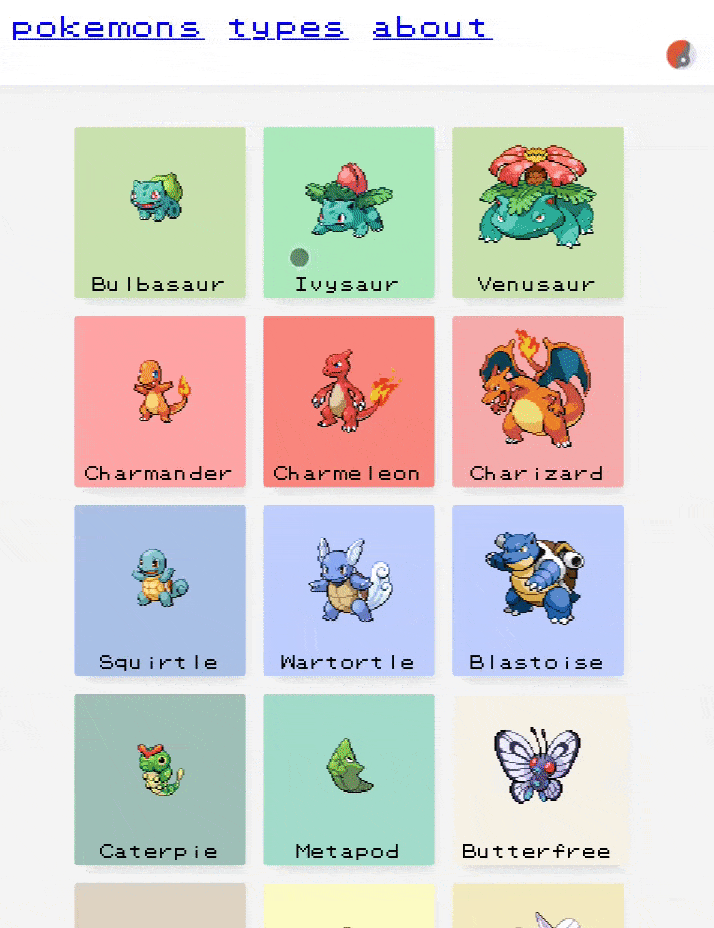

#  ampokedex


[](https://github.com/Platane/ampokedex/actions?query=workflow%3Atest)

Pokedex App powered by amp

<p align="center">
  
</p>

[ampokedex](https://platane.github.io/ampokedex)

Featuring:

- ⚡ amp pages [\*](https://search.google.com/test/amp?url=https%3A%2F%2Fplatane.github.io%2Fampokedex%2Fpokemon%2Fcharizard)[\*](https://search.google.com/test/amp?url=https%3A%2F%2Fplatane.github.io%2Fampokedex)
- 🎠 nice page transition
- 🚀 sweet lighthouse score [\*](https://lighthouse-dot-webdotdevsite.appspot.com//lh/html?url=https%3A%2F%2Fplatane.github.io%2Fampokedex%2Fpokemon%2Fcharizard)[\*](https://lighthouse-dot-webdotdevsite.appspot.com//lh/html?url=https%3A%2F%2Fplatane.github.io%2Fampokedex%2Fpokemon%2Fcharizard)

# Table of Contents

- [Install](#install)
- [Usage](#usage)
- [Implementation](#implementation)
  - [Static pages](#static-pages)
  - [App shell](#app-shell)
  - [Page transition](#page-transition)
- [Thanks](#thanks)

# Install

```sh
yarn
```

# Usage

```sh

# build pages and service worker and app shell script and prepare images
yarn build

# serves pages
yarn serve

```

# Motivation

This app demonstrate the use of an app shell using amp shell.

Usually to have this kind of interaction means having to serve amp pages + a react app with the exact same rendering. This solution is much simpler.

# Implementation

## Static pages

All pages are build in github action and served from github pages.

Data is pulled from [pokeapi](https://pokeapi.com). With [restrictions](./builder/pokeapi/README.md) to respect fair use.

## App shell

Upon first visit, the page install a service worker.

Next navigation will redirect to the app shell (which is not an amp page).

The app shell leverage [amp shadow doc](https://github.com/ampproject/amphtml/blob/master/spec/amp-shadow-doc.md) to display content.

## Page transition

When navigating inside the app shell, the page is not reloaded.

Allowing for continuous animation (such as the rolling pokeball in the nav bar ). As Well as page transition.

# Thanks

Thanks to the [pokeapi](https://github.com/PokeAPI/pokeapi) community for the work.

Pokémon and Pokémon character names are trademarks of [Nintendo](https://www.pokemon.com/us/legal)
